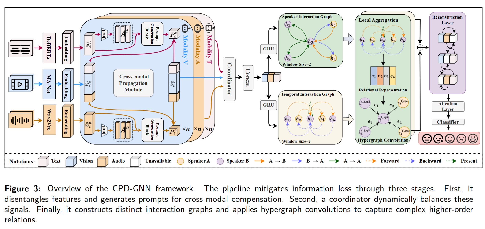

# CPD-GNN

Official PyTorch implementation of CPD-GNN (Cross-Modal Prompt Disentangled Graph Neural Network) for incomplete multimodal conversational emotion recognition.

## Overview



## Files

This minimal release contains only the files required for training and evaluation:

- `train.py`: training and evaluation entry point
- `model.py`: CPD-GNN model definitions
- `graph.py`: graph construction utilities
- `dataloader_iemocap.py`, `dataloader_cmumosi.py`: dataset loaders
- `loss.py`: classification, reconstruction, and disentanglement losses
- `path.py`: configurable dataset/result paths
- `requirements.txt`: runtime dependencies

## Datasets

The following datasets are used in this research:

[IEMOCAP](https://sail.usc.edu/iemocap/index.html), [CMU-MOSI](http://multicomp.cs.cmu.edu/resources/cmu-mosi-dataset/), [CMU-MOSEI](http://multicomp.cs.cmu.edu/resources/cmu-mosei-dataset/)

The extracted dataset features can be downloaded from [Baidu Netdisk](https://pan.baidu.com/s/1C4j27t1hK9MVKTPLLU2fkg?pwd=pv6e).

## Data Layout

By default, data is expected under:

```text
features/dataset/dataset/
  CMUMOSI/
  CMUMOSEI/
  IEMOCAPFour/
  IEMOCAP/
```

You can also set `CPD_GNN_DATA_DIR` to the directory that contains these dataset folders. Results are saved to `result/` by default, or to `CPD_GNN_RESULT_DIR` if set.

## Example

```bash
python train.py --use-prompt --loss-recon --dataset IEMOCAPSix --audio-feature wav2vec-large-c-UTT --text-feature deberta-large-4-UTT --video-feature manet_UTT --base-model GRU --mask-type constant-0.4
```

## Attribution

This repository should be used and cited together with the CPD-GNN paper. Some graph-based training utilities are adapted from prior incomplete multimodal conversational emotion recognition code and should be acknowledged according to the license and citation requirements in `NOTICE.md`.
